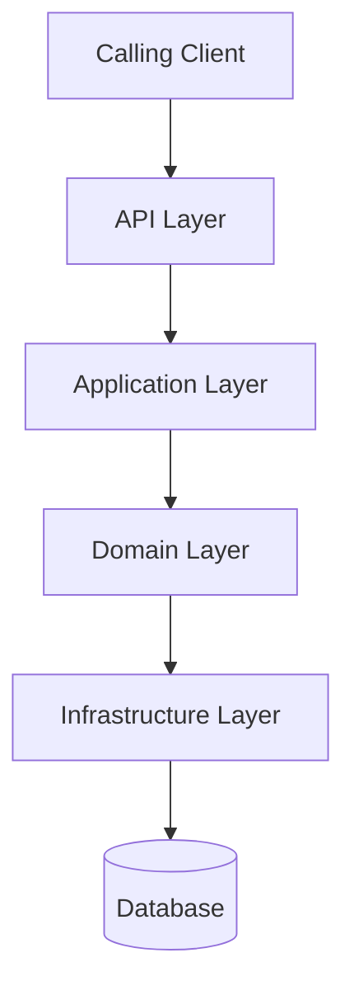

# Microservices Documentation Starter

## 1. Project Purpose

Build a starter internal technical documentation portal for a application built using multiple backend microservices.

This project is a **documentation framework and standard**, not a system for automatically generating the organization's actual technical documentation.

The organization does not allow external AI tools such as Cursor to generate or process the real internal documentation content.

Therefore, Cursor should only be used to create:

* The Docusaurus project
* Documentation structure
* Standard folder conventions
* Markdown boilerplates
* Templates
* Example documentation
* Navigation
* Mermaid support
* Documentation rules

The actual documentation content will later be created manually by developers, potentially with assistance from an approved internal chatbot.

Do not generate fictional versions of the organization's real architecture, services, APIs, providers, infrastructure, or workflows.

Use generic examples and clearly marked placeholders.

---

# 2. Primary Goal

The goal is to create a standard documentation system so that every microservice follows the same structure.

Developers should not need to decide:

* Which documentation files to create
* Where to document flows
* Where to document providers
* How to structure API documentation
* How to document events
* How to document dependencies

The project should provide the structure for them.

The expected workflow is:

```text
New Microservice
      ↓
Copy Example Service Structure
      ↓
Rename Service
      ↓
Fill Existing Markdown Files
      ↓
Add Service-Specific Flows
      ↓
Document Service-Specific Providers
      ↓
Documentation Automatically Follows Company Standard
```

---

# 3. Core Principles

## Documentation First

Documentation must primarily use:

```text
Markdown (.md)
MDX only when necessary
Mermaid diagrams
Docusaurus built-in documentation features
```

Avoid building documentation pages using custom React components.

Developers should be able to document a service by editing Markdown files.

---

## Standardization Over Flexibility

Every microservice should start with the same documentation structure.

Do not allow every team or developer to invent their own folder structure.

The documentation framework should make the standard approach the easiest approach.

---

## Service Ownership

Each microservice owns its documentation.

All service-specific information should exist inside the service folder.

This includes:

* Service overview
* Architecture
* APIs
* Database
* Events
* Dependencies
* Flows
* External providers
* Provider history
* Integration notes
* Known issues related to providers

Example:

```text
services/
└── payment-service/
    ├── overview.md
    ├── architecture.md
    ├── api.md
    ├── database.md
    ├── events.md
    ├── dependencies.md
    │
    ├── flows/
    │   ├── create-payment.md
    │   └── process-webhook.md
    │
    └── providers/
        └── example-provider/
            ├── overview.md
            ├── integration.md
            ├── authentication.md
            ├── api-usage.md
            ├── webhooks.md
            ├── errors.md
            ├── known-issues.md
            └── history.md
```

There must be no global provider documentation folder.

Provider documentation belongs inside the service that owns the integration.

---

# 4. Technology Stack

Use:

```text
Docusaurus
Markdown
MDX when required
Mermaid
Node.js
npm
Git
```

Keep the project simple.

Do not add:

* Databases
* Backend services
* Authentication systems
* State management
* Complex dashboards
* Unnecessary UI libraries

This is a static technical documentation portal.

---

# 5. Project Structure

Use this structure:

```text
docs/

├── docs/
│
│   ├── introduction/
│   │   ├── overview.md
│   │   ├── business-context.md
│   │   └── glossary.md
│   │
│   ├── architecture/
│   │   ├── system-context.md
│   │   ├── microservices-overview.md
│   │   ├── communication.md
│   │   ├── data-architecture.md
│   │   ├── infrastructure.md
│   │   └── security.md
│   │
│   ├── services/
│   │   │
│   │   └── example-service/
│   │       ├── overview.md
│   │       ├── architecture.md
│   │       ├── api.md
│   │       ├── database.md
│   │       ├── events.md
│   │       ├── dependencies.md
│   │       │
│   │       ├── flows/
│   │       │   └── example-flow.md
│   │       │
│   │       └── providers/
│   │           └── example-provider/
│   │               ├── overview.md
│   │               ├── integration.md
│   │               ├── authentication.md
│   │               ├── api-usage.md
│   │               ├── webhooks.md
│   │               ├── errors.md
│   │               ├── known-issues.md
│   │               └── history.md
│   │
│   ├── communication/
│   │   ├── rest.md
│   │   ├── asynchronous-messaging.md
│   │   ├── event-conventions.md
│   │   ├── retry-strategy.md
│   │   └── error-handling.md
│   │
│   ├── operations/
│   │   ├── environments.md
│   │   ├── deployment.md
│   │   ├── monitoring.md
│   │   ├── logging.md
│   │   └── troubleshooting.md
│   │
│   ├── adr/
│   │   ├── overview.md
│   │   └── template.md
│   │
│   └── templates/
│       ├── microservice-template.md
│       ├── flow-template.md
│       ├── provider-template.md
│       ├── event-template.md
│       ├── api-template.md
│       ├── database-template.md
│       └── adr-template.md
│
├── static/
│   └── img/
│
├── src/
│
├── docusaurus.config.js
├── sidebars.js
├── package.json
├── README.md
└── CURSOR_PROJECT.md
```

Only one example service should initially be implemented.

Do not create multiple fake services.

The `example-service` exists purely to demonstrate the company documentation standard.

---

# 6. Example Service

Create one complete example service:

```text
example-service/
```

This service must demonstrate the complete documentation structure.

It should contain:

```text
example-service/

├── overview.md
├── architecture.md
├── api.md
├── database.md
├── events.md
├── dependencies.md
│
├── flows/
│   └── example-flow.md
│
└── providers/
    └── example-provider/
        ├── overview.md
        ├── integration.md
        ├── authentication.md
        ├── api-usage.md
        ├── webhooks.md
        ├── errors.md
        ├── known-issues.md
        └── history.md
```

Use generic names and placeholders.

For example:

```text
Example Service
Example Provider
Example Flow
```

Do not use real company service names.

Do not create fictional business logic.

The example should demonstrate documentation formatting and structure only.

---

# 7. Standard Microservice Structure

Every new microservice should follow this structure:

```text
service-name/

├── overview.md
├── architecture.md
├── api.md
├── database.md
├── events.md
├── dependencies.md
│
├── flows/
│
└── providers/
```

The minimum required documentation for every service is:

1. Overview
2. Architecture
3. API
4. Database
5. Events
6. Dependencies

The `flows` and `providers` directories should be used when applicable.

---

# 8. Overview Documentation

Every service must contain:

```text
overview.md
```

Standard sections:

```markdown
# Service Name

## Purpose

<!-- Describe why this service exists. -->

## Responsibilities

<!-- List the primary responsibilities. -->

## Scope

<!-- Describe what this service owns. -->

## Out of Scope

<!-- Describe what this service does not own. -->

## Technologies

| Technology | Purpose |
|---|---|
| [Technology] | [Purpose] |

## Communication

| Type | Technology | Purpose |
|---|---|---|
| [Sync/Async] | [Technology] | [Purpose] |
```

Do not remove these sections when documenting a real service.

Additional sections may be added if required.

---

# 9. Architecture Documentation

Every service must contain:

```text
architecture.md
```

Standard sections:

```markdown
# Service Architecture

## Overview

<!-- Describe the high-level architecture. -->

## Architecture Diagram

<!-- Add Mermaid architecture diagram here. -->

## Main Components

| Component | Responsibility |
|---|---|
| [Component] | [Responsibility] |

## External Dependencies

<!-- List external dependencies. -->

## Data Flow

<!-- Describe how data flows through the service. -->
```

Use Mermaid when diagrams are useful.

Example:



The diagram is only an example.

Real services may have different architectures.

---

# 10. API Documentation

Every service must contain:

```text
api.md
```

Standard sections:

```markdown
# API Documentation

## Overview

<!-- Describe the APIs exposed by this service. -->

## Authentication

<!-- Describe authentication requirements. -->

## API Groups

| Group | Description |
|---|---|
| [Group] | [Description] |

## Request Standards

<!-- Describe common request conventions. -->

## Response Standards

<!-- Describe common response conventions. -->

## Error Handling

<!-- Describe error response format. -->

## Detailed API Reference

<!-- Link to OpenAPI/Swagger documentation if available. -->
```

Do not manually duplicate a complete Swagger specification if one already exists.

This page should explain the API at a high level and link to detailed API references.

---

# 11. Database Documentation

Every service must contain:

```text
database.md
```

Standard sections:

```markdown
# Database

## Overview

<!-- Describe the database owned by this service. -->

## Database Ownership

<!-- Explain which service owns this data. -->

## Important Entities

| Entity | Purpose |
|---|---|
| [Entity] | [Purpose] |

## Data Relationships

<!-- Add Mermaid ER or flow diagram if useful. -->

## Data Access Rules

<!-- Document which services can access this data. -->

## Important Constraints

<!-- Document important data rules. -->
```

Do not document another service's database inside this service.

---

# 12. Events Documentation

Every service must contain:

```text
events.md
```

Standard structure:

```markdown
# Events

## Published Events

### event.name

**Trigger**

<!-- When is this event published? -->

**Consumers**

- [Service]

**Purpose**

<!-- Explain why this event exists. -->

---

## Consumed Events

### event.name

**Producer**

[Service]

**Purpose**

<!-- Explain why this service consumes this event. -->
```

Each service should document only events that it publishes or consumes.

---

# 13. Dependencies Documentation

Every service must contain:

```text
dependencies.md
```

Standard sections:

```markdown
# Dependencies

## Internal Service Dependencies

| Service | Communication | Purpose |
|---|---|---|
| [Service] | [REST/Event/etc.] | [Purpose] |

## External Infrastructure

| Dependency | Purpose |
|---|---|
| [Database/Cache/Broker] | [Purpose] |

## External Providers

<!-- Link to provider documentation inside this service's providers directory. -->
```

---

# 14. Flows Must Belong to the Service

Flows must exist inside the service responsible for them.

Example:

```text
services/
└── service-name/
    └── flows/
        ├── create-resource.md
        ├── update-resource.md
        └── process-webhook.md
```

Do not create a global folder containing all service flows.

If a flow involves multiple services, place it under the service that owns or orchestrates the flow.

The documentation must explicitly list all participating services.

---

# 15. Flow Template

Every flow should follow this structure:

````markdown
# Flow Name

## Overview

<!-- Briefly describe the purpose of this flow. -->

## Trigger

<!-- What starts this flow? -->

## Flow Owner

[Service Name]

## Participating Services

- [Service A]
- [Service B]

## External Providers

- [Provider]

## Flow Diagram

```mermaid
sequenceDiagram

    participant Client
    participant Service
    participant Dependency

    Client->>Service: Request
    Service->>Dependency: Action
    Dependency-->>Service: Response
    Service-->>Client: Response
````

## Step-by-Step Execution

### Step 1

<!-- Description -->

### Step 2

<!-- Description -->

## APIs Involved

| Service | Method | Endpoint | Purpose |
| ------- | ------ | -------- | ------- |

## Events

### Published

* [event.name]

### Consumed

* [event.name]

## Error Handling

<!-- Describe relevant error scenarios. -->

## Retry Strategy

<!-- Describe retry behavior. -->

## Important Notes

<!-- Add important implementation details. -->

````

---

# 16. Provider Documentation Must Exist Inside the Service

There must be no global provider documentation folder.

Provider information belongs inside the service that owns the provider integration.

Example:

```text
services/
└── payment-service/
    └── providers/
        └── payment-provider/
            ├── overview.md
            ├── integration.md
            ├── authentication.md
            ├── api-usage.md
            ├── webhooks.md
            ├── errors.md
            ├── known-issues.md
            └── history.md
````

Another service may have its own provider documentation:

```text
services/
└── identity-service/
    └── providers/
        └── identity-provider/
```

Provider documentation should remain close to the integration code and service documentation.

---

# 17. Provider Documentation Template

Every provider folder should follow this structure:

```markdown
# Provider Name

## Purpose

<!-- Why does this service use this provider? -->

## Integration Owner

[Service Name]

## Integration Overview

<!-- Describe how this service integrates with the provider. -->

## Authentication

<!-- Describe authentication mechanism without exposing secrets. -->

## APIs Used

| API | Purpose |
|---|---|
| [API] | [Purpose] |

## Configuration

<!-- Document configuration names and purposes without exposing secrets. -->

## Related Flows

<!-- Link to flows in ../flows/ that use this provider. -->
```

Additional provider-specific documentation should be placed in:

```text
integration.md
authentication.md
api-usage.md
webhooks.md
errors.md
known-issues.md
history.md
```

---

# 18. Provider History

Provider history belongs inside the provider folder:

```text
service-name/
└── providers/
    └── provider-name/
        └── history.md
```

Standard format:

```markdown
# Provider Integration History

## YYYY-MM-DD

### Change

<!-- Describe the change. -->

### Reason

<!-- Why was the change required? -->

### Impact

<!-- What changed in the system? -->

### Related Flow

<!-- Link to related flow if applicable. -->
```

The goal is to help future developers understand:

> Why was this provider integration changed?

---

# 19. Global Architecture Documentation

The global architecture section should only contain platform-level documentation.

```text
architecture/

├── system-context.md
├── microservices-overview.md
├── communication.md
├── data-architecture.md
├── infrastructure.md
└── security.md
```

Do not duplicate detailed service documentation here.

The architecture section should answer:

* What are the major parts of the platform?
* How do the microservices communicate?
* What infrastructure exists?
* What are the major security boundaries?

Detailed service information belongs inside `services/`.

---

# 20. Communication Standards

The global communication documentation should define standards.

Examples:

```text
REST communication
Asynchronous messaging
Event naming
Retry strategy
Error handling
Correlation IDs
Idempotency
Timeout policies
```

Individual service communication details belong inside the relevant service documentation.

---

# 21. Architecture Decision Records

Architecture decisions should be stored globally:

```text
docs/adr/
```

Use the following format:

```markdown
# ADR-XXX: Title

## Status

Proposed / Accepted / Deprecated / Superseded

## Date

YYYY-MM-DD

## Context

<!-- Describe the problem. -->

## Options Considered

### Option 1

**Advantages**

- ...

**Disadvantages**

- ...

### Option 2

**Advantages**

- ...

**Disadvantages**

- ...

## Decision

<!-- Describe the selected option. -->

## Consequences

### Positive

- ...

### Negative

- ...

## Related Services

- [Service]

## Related Documentation

- [Documentation Link]
```

---

# 22. Templates Directory

Create reusable boilerplate templates inside:

```text
docs/templates/
```

Required templates:

```text
microservice-template.md
flow-template.md
provider-template.md
event-template.md
api-template.md
database-template.md
adr-template.md
```

These templates should contain only structure and placeholders.

They should not contain fictional business information.

---

# 23. Creating a New Service

Document the recommended process in the project README.

The process should be:

```text
1. Copy example-service.

2. Rename the folder.

3. Update document titles.

4. Fill overview.md.

5. Document service architecture.

6. Document APIs.

7. Document database ownership.

8. Document events.

9. Document dependencies.

10. Add flows if applicable.

11. Add provider documentation if applicable.

12. Verify Mermaid diagrams.

13. Run the documentation project locally.

14. Submit documentation changes through the normal Git workflow.
```

The example service should be easy to copy and use as a starting point.

---

# 24. Documentation Rules for Developers

Create a clear documentation rules section in `README.md`.

The rules should include:

1. Every service must follow the standard folder structure.
2. Do not create custom documentation structures without discussion.
3. Use Markdown by default.
4. Use MDX only when necessary.
5. Keep flows inside the owning service.
6. Keep provider information inside the service that owns the provider integration.
7. Do not create a global provider catalog.
8. Use Mermaid for maintainable diagrams when possible.
9. Do not commit secrets or sensitive information.
10. Do not include production credentials.
11. Sanitize API examples.
12. Do not document customer or personal data.
13. Link related documentation instead of duplicating content.
14. Keep documentation updated when architecture changes.
15. Update provider history when significant provider changes occur.

---

# 25. Sidebar Structure

The sidebar should be documentation-focused.

Recommended structure:

```text
Introduction

Architecture
├── System Context
├── Microservices Overview
├── Communication
├── Data Architecture
├── Infrastructure
└── Security

Services
└── Example Service
    ├── Overview
    ├── Architecture
    ├── API
    ├── Database
    ├── Events
    ├── Dependencies
    ├── Flows
    │   └── Example Flow
    └── Providers
        └── Example Provider
            ├── Overview
            ├── Integration
            ├── Authentication
            ├── API Usage
            ├── Webhooks
            ├── Errors
            ├── Known Issues
            └── History

Communication Standards

Operations

Architecture Decisions

Templates
```

Use autogenerated sidebars where they make maintenance easier.

Do not manually maintain a large complex sidebar if automatic generation provides the same result.

---

# 26. Security Rules

This is documentation for a application.

Never include:

```text
API keys
Passwords
Production credentials
JWT secrets
Private keys
Private certificates
Database connection strings
Customer data
Personal data
Production tokens
Sensitive data
```

Use placeholders:

```text
<API_KEY>
<CLIENT_ID>
<REDACTED>
<SECRET_VALUE>
```

All request and response examples must be sanitized.

---

# 27. UI Requirements

Keep the default Docusaurus documentation experience.

Prioritize:

* Readability
* Navigation
* Search
* Mermaid diagrams
* Code blocks
* Tables
* Dark mode
* Mobile support

Avoid:

* Complex dashboards
* Excessive animations
* Custom React components
* State management
* Unnecessary frontend libraries

This project is a documentation portal, not a custom web application.

---

# 28. Cursor Development Rules

When implementing this project:

1. Read this `CURSOR_PROJECT.md` before making changes.
2. Use this file as the project specification.
3. Build only the starter documentation framework.
4. Do not generate real organizational documentation.
5. Do not create fake versions of real services.
6. Create only one generic example service.
7. Use placeholders for actual implementation details.
8. Prefer Markdown over React components.
9. Keep flows inside the owning service.
10. Keep provider documentation inside the owning service.
11. Do not create a global provider directory.
12. Do not introduce unnecessary dependencies.
13. Keep the Docusaurus configuration simple.
14. Do not refactor unrelated files.
15. Verify the project builds after implementation.
16. Fix build errors before considering the implementation complete.

---

# 29. Initial Implementation Task

Build the complete starter project.

The implementation should include:

## Step 1 — Docusaurus Setup

* Create or configure the Docusaurus project.
* Remove unnecessary default example content.
* Configure Mermaid support.
* Ensure the development server works.

## Step 2 — Documentation Structure

Create:

```text
Introduction
Architecture
Services
Communication
Operations
ADR
Templates
```

## Step 3 — Example Service

Create one complete:

```text
example-service
```

Include:

```text
Overview
Architecture
API
Database
Events
Dependencies
Flows
Providers
```

## Step 4 — Example Flow

Create one generic example flow using Mermaid.

The example should demonstrate the expected documentation format.

Do not use real business logic.

## Step 5 — Example Provider

Create one generic provider inside:

```text
example-service/providers/example-provider/
```

Include all standard provider documentation files.

## Step 6 — Templates

Create all reusable Markdown templates.

## Step 7 — Navigation

Configure the sidebar so the entire example documentation structure is visible and easy to navigate.

## Step 8 — README

Create a clear `README.md` explaining:

* Project purpose
* How to install
* How to run
* Documentation structure
* How to create a new service
* Documentation rules
* How to use the example service
* Security guidelines

## Step 9 — Validation

Verify:

```text
npm install
npm run start
npm run build
```

Fix any errors.

At completion, provide a concise summary of:

* Files created
* Files modified
* Project structure
* Commands required to run the project

Do not continue by generating real service documentation.
