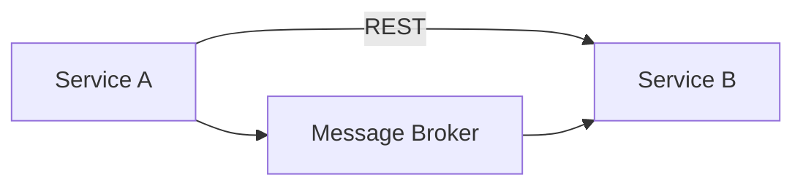

# Communication

Describe how microservices communicate at the **platform** level. Service-specific endpoints, events, and providers belong in the owning service folder.

## Communication styles

| Style | Typical use | Standard |
|---|---|---|
| Synchronous | [Purpose] | [REST](../communication/rest.md) |
| Asynchronous | [Purpose] | [Asynchronous Messaging](../communication/asynchronous-messaging.md) |

## Platform communication diagram

## Cross-cutting standards

Document these in [Communication Standards](../communication/rest.md), not in individual service pages:

- REST conventions
- Asynchronous messaging
- Event naming
- Retry strategy
- Error handling
- Correlation IDs
- Idempotency
- Timeout policies

## Related documentation

- [Data Architecture](./data-architecture.md)
- [Event Conventions](../communication/event-conventions.md)
