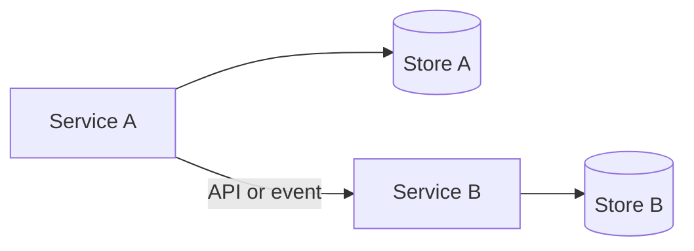

# Data Architecture

Describe platform-level data ownership and storage patterns. Do not document another service's database inside a service folder, and do not duplicate entity-level detail here.

## Principles

<!-- State platform data rules. -->

- Each service owns its data.
- Other services access that data through published APIs or events, not by sharing the database.
- [Additional principle]

## Data stores

| Store | Used for | Owning service |
|---|---|---|
| [Database / cache / warehouse] | [Purpose] | [Service] |

## Data flow (platform level)

## Related documentation

- Service-level data details belong in each service `database.md`
- [Database template](../templates/database-template.md)
