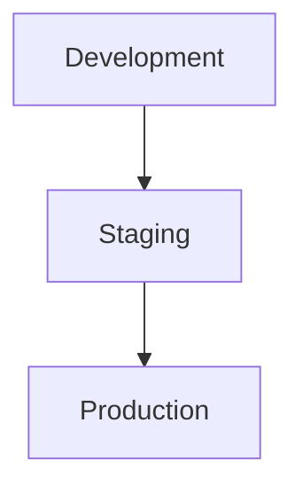

# Infrastructure

Describe the major infrastructure used by the platform. Keep this at platform level. Environment-specific runbooks belong in [Operations](../operations/environments.md).

## Overview

<!-- Describe where the platform runs. -->

[Infrastructure summary]

## Major components

| Component | Purpose |
|---|---|
| [Compute] | [Purpose] |
| [Network] | [Purpose] |
| [Datastore] | [Purpose] |
| [Message broker] | [Purpose] |
| [Observability] | [Purpose] |

## Environment topology

Use placeholders only. Do not include production hostnames, connection strings, or credentials.

## Related documentation

- [Environments](../operations/environments.md)
- [Deployment](../operations/deployment.md)
- [Security](./security.md)
