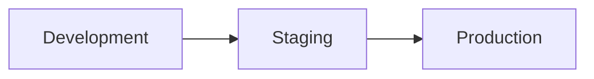

# Environments

Platform environments. Do not include production hostnames, credentials, or connection strings.

## Environment list

| Environment | Purpose |
|---|---|
| Development | `[Purpose]` |
| Staging | `[Purpose]` |
| Production | `[Purpose]` |

## Configuration

Document **configuration names and purpose**, not secret values.

| Name | Purpose |
|---|---|
| `[CONFIG_NAME]` | `[Purpose]` |

Use placeholders such as `<API_KEY>`, `<CLIENT_ID>`, and `<SECRET_VALUE>`.

## Promotion flow

## Related documentation

- [Deployment](./deployment.md)
- [Infrastructure](../architecture/infrastructure.md)
