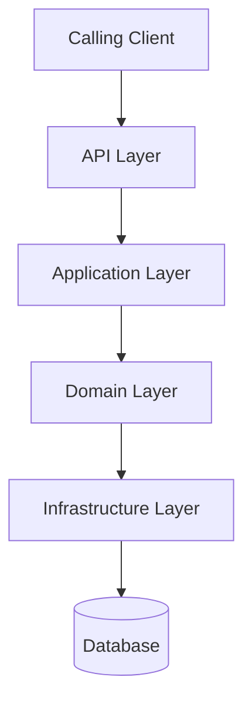

# Service Architecture

## Overview

<!-- Describe the high-level architecture. -->

Example Service uses a layered structure. Real services may differ. Replace this diagram and the component list with the actual architecture.

## Architecture Diagram

<!-- Add Mermaid architecture diagram here. -->

## Main Components

| Component | Responsibility |
|---|---|
| API Layer | Accepts requests and returns responses |
| Application Layer | Orchestrates use cases and flows |
| Domain Layer | Contains business rules owned by this service |
| Infrastructure Layer | Accesses the database, broker, and providers |
| [Component] | [Responsibility] |

## External Dependencies

<!-- List external dependencies. -->

- [Internal service]
- [Example Provider](./providers/example-provider/overview.md)
- [Database / cache / broker]

See [dependencies.md](./dependencies.md) for the full list.

## Data Flow

<!-- Describe how data flows through the service. -->

1. A calling client sends a request to the API layer.
2. The application layer runs the relevant flow.
3. The infrastructure layer reads or writes owned data and may call Example Provider.
4. The service returns a response and may publish an event.
