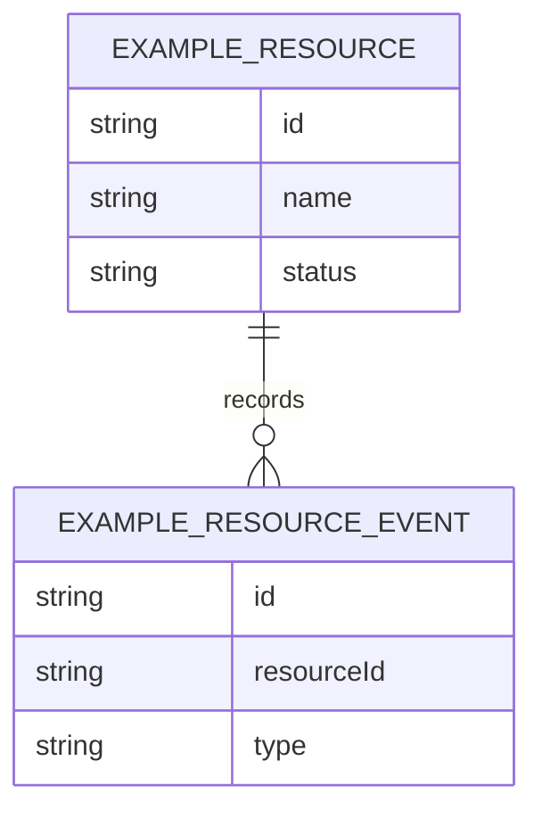

# Database

## Overview

<!-- Describe the database owned by this service. -->

Example Service owns its own datastore. Do not document another service's database here.

## Database Ownership

<!-- Explain which service owns this data. -->

Example Service is the only writer of this data. Other services should use this service's API or events.

## Important Entities

| Entity | Purpose |
|---|---|
| ExampleResource | Placeholder entity for the documentation standard |
| [Entity] | [Purpose] |

## Data Relationships

<!-- Add Mermaid ER or flow diagram if useful. -->

## Data Access Rules

<!-- Document which services can access this data. -->

| Accessor | Access | Path |
|---|---|---|
| Example Service | Read / write | Direct |
| [Other service] | Read via API or events | No direct database access |

## Important Constraints

<!-- Document important data rules. -->

- `[Constraint]`
- Do not store secrets, customer data, or personal data in documentation examples
