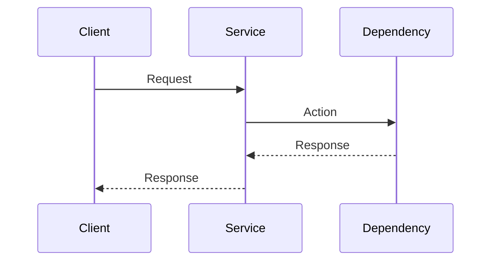

# Example Flow

## Overview

<!-- Briefly describe the purpose of this flow. -->

Example Flow shows the required flow documentation format. It is a generic request/response flow with one downstream dependency. It is not a real business workflow.

## Trigger

<!-- What starts this flow? -->

A calling client sends a request to Example Service.

## Flow Owner

Example Service

## Participating Services

- Example Service
- [Service B]

## External Providers

- [Example Provider](../providers/example-provider/overview.md)

## Flow Diagram

## Step-by-Step Execution

### Step 1

<!-- Description -->

The client calls Example Service with a sanitized request.

### Step 2

<!-- Description -->

Example Service validates the request and calls the dependency or provider.

### Step 3

<!-- Description -->

Example Service stores owned data if required, publishes an event if required, and returns a response.

## APIs Involved

| Service | Method | Endpoint | Purpose |
| ------- | ------ | -------- | ------- |
| Example Service | `POST` | `/example-resources` | Start the flow |
| [Dependency] | `[METHOD]` | `[/path]` | [Purpose] |

## Events

### Published

* example.resource.created

### Consumed

* [event.name]

## Error Handling

<!-- Describe relevant error scenarios. -->

- Validation failure: return `400` and do not call the dependency
- Dependency failure: follow [Retry Strategy](../../../communication/retry-strategy.md) and [Error Handling](../../../communication/error-handling.md)

## Retry Strategy

<!-- Describe retry behavior. -->

Retry retryable dependency failures with the platform backoff policy. Do not retry non-retryable client errors.

## Important Notes

<!-- Add important implementation details. -->

- Keep this flow under the owning service
- If multiple services participate, list all of them here
- Do not create a global flows folder
