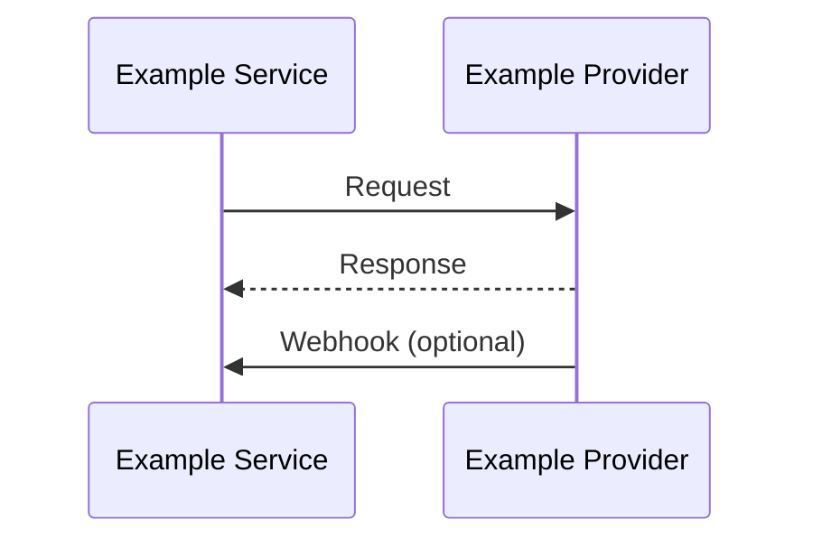

# Example Provider Integration

## Integration Owner

Example Service

## How the integration works

<!-- Describe how this service integrates with the provider. -->

1. Example Service sends a sanitized request to Example Provider.
2. Example Provider returns a sanitized response.
3. Optional webhooks are handled as documented in [webhooks.md](./webhooks.md).

## Runtime location

<!-- Describe where configuration lives, not secret values. -->

- Configuration names: see [overview.md](./overview.md)
- Related flow: [Example Flow](../../flows/example-flow.md)

## Out of scope

- Credentials and production tokens
- Other services' provider integrations (those belong under the other service)
