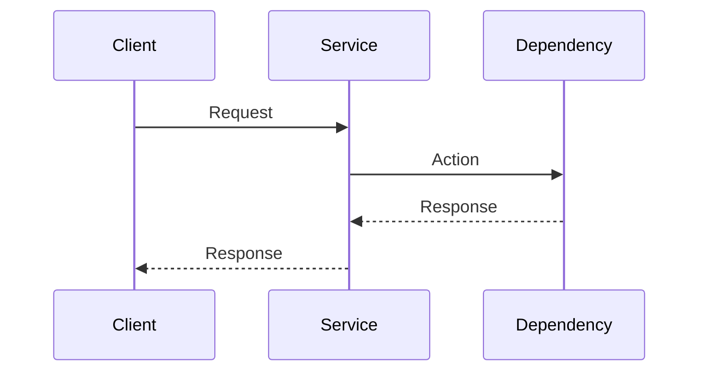

# Flow Template

Place each flow under the owning service: `services/<service-name>/flows/<flow-name>.md`.

````markdown
# Flow Name

## Overview

<!-- Briefly describe the purpose of this flow. -->

## Trigger

<!-- What starts this flow? -->

## Flow Owner

[Service Name]

## Participating Services

- [Service A]
- [Service B]

## External Providers

- [Provider]

## Flow Diagram



## Step-by-Step Execution

### Step 1

<!-- Description -->

### Step 2

<!-- Description -->

## APIs Involved

| Service | Method | Endpoint | Purpose |
| ------- | ------ | -------- | ------- |

## Events

### Published

* [event.name]

### Consumed

* [event.name]

## Error Handling

<!-- Describe relevant error scenarios. -->

## Retry Strategy

<!-- Describe retry behavior. -->

## Important Notes

<!-- Add important implementation details. -->
````
